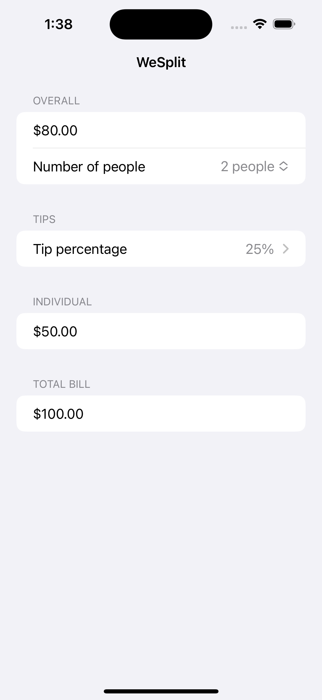

# WeSplit - iOS Bill Splitting App

WeSplit is a simple and intuitive iOS app designed to make splitting the bill at restaurants hassle-free. No more headaches trying to divide the bill among friends or family; WeSplit does it for you!

## Features

- **Easy Bill Entry:** Input the total bill amount, number of people, and the tip percentage – WeSplit will calculate the individual share for each person instantly.

- **Customizable Tip:** Adjust the tip percentage based on your preference or local tipping customs.

- **Round-Up Option:** Round up the share amount to the nearest whole number, making it convenient for everyone to pitch in.

## How to Use
1. Open the app and enter the total bill amount.
2. Input the number of people sharing the bill.
3. Choose a tip percentage.
4. The individual bill amount shall appear instantly.

## Screenshots

## License

This project is licensed under the [MIT License](https://opensource.org/licenses/MIT). See the `LICENSE` file for details.
